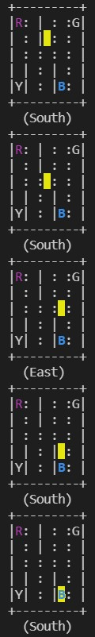
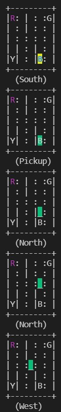
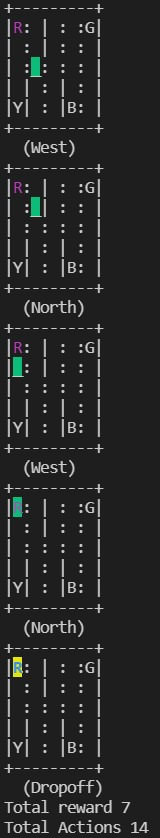

# Reinforcement-Learning-Open-AI-gym---Taxi
Train the device to drive the taxi, pick up the passenger at one location and drop him off in another. The code involves the implementation which provides maximum reward in minimum steps. 

# Getting Started

  ## Pre-requisites
  
  * Python
  * Numpy
  * Gym
  * Git Desktop

  ## Steps

  1. Clone the repo
  2. Run the file

  ## 1. Clone the repo: 
  Clone the Image Processing repo locally. In a terminal, run:   
  ```
        $ git clone https://github.com/GaurangSharma18/Reinforcement-Learning-Open-AI-gym---Taxi.git
        $ cd Reinforcement-Learning-Open-AI-gym---Taxi
        $ git pull
  ```
        
  ## 2. Run the Application  
  ```
        $ python Taxi_reinforecement_learning.py
  ``` 
 
 # Problem Description
    The Taxi Problem
    from "Hierarchical Reinforcement Learning with the MAXQ Value Function Decomposition"
    by Tom Dietterich
    
   ## Description:
    There are four designated locations in the grid world indicated by R(ed), G(reen), Y(ellow), and B(lue). 
    When the episode starts, the taxi starts off at a random square and  the passenger is at a random location. 
    The taxi drives to the passenger's location, picks up the passenger, drives to the passenger's destination (another one of the four specified locations), 
    and then drops off the passenger. 
    Once the passenger is dropped off, the episode ends.
    
   ## Observations:
    There are 500 discrete states since there are 25 taxi positions, 5 possible locations of the passenger (including the case when the passenger is in the taxi), 
    and 4 destination locations.
    Note that there are 400 states that can actually be reached during an episode. 
    The missing states correspond to situations in which the passenger is at the same location as their destination, as this typically signals the end of an episode.
    Four additional states can be observed right after a successful episodes, when both the passenger and the taxi are at the destination.
    This gives a total of 404 reachable discrete states.
    
   ### Passenger locations:
    - 0: R(ed)
    - 1: G(reen)
    - 2: Y(ellow)
    - 3: B(lue)
    - 4: in taxi
   ### Destinations:
    - 0: R(ed)
    - 1: G(reen)
    - 2: Y(ellow)
    - 3: B(lue)
   ### Actions:
    There are 6 discrete deterministic actions:
    - 0: move south
    - 1: move north
    - 2: move east
    - 3: move west
    - 4: pickup passenger
    - 5: drop off passenger
   ### Rewards:
    There is a default per-step reward of -1,
    except for delivering the passenger, which is +20,
    or executing "pickup" and "drop-off" actions illegally, which is -10.
   ### Rendering:
    - blue: passenger
    - magenta: destination
    - yellow: empty taxi
    - green: full taxi
    - other letters (R, G, Y and B): locations for passengers and destinations


# Path Covered
<div float="left">
  
  
  
</div>


# Refrences
1. https://gym.openai.com/docs/
2. https://github.com/openai/gym/blob/master/gym/envs/toy_text/taxi.py
